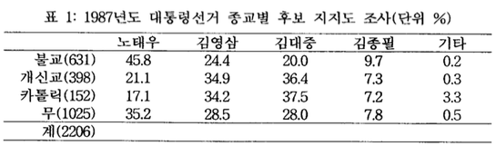

Data for Practice
-----------------

한국 갤럽의 1987년 대선 여론조사 자료를 예제로 활용한다.
김용옥 선생이 '나는 불교를 이렇게 본다'에서 인용한 한국갤럽의 발표자료는 



우선 이 자료를 입력하여 파일로 저장하자. 종교별 표본수를 먼저 벡터로 저장하고, 이름을 정한다.

```{r}
N.Religion<-c(631, 398, 152, 1025)
names(N.Religion)<-c("Buddhism", "Protestant", "Catholic", "None")
```

`table` 구조, 사실상 `matrix`로 읽어들인다.

```{r}
poll.87<-matrix(c(45.8, 21.1, 17.1, 35.2, 24.4, 34.9, 34.2, 28.5, 20.0, 36.4, 37.5, 28.0, 9.7, 7.3, 7.2, 7.8, 0.2, 0.3, 3.3, 0.5), nrow=4, ncol=5)
poll.87
```

필요한 변수명을 넣는다. 

```{r}
poll.names<-list(Religion=names(N.Religion), Candidates=c("Roh", "YS", "DJ", "JP", "etc"))
dimnames(poll.87)<-poll.names
poll.87
class(poll.87)
str(poll.87)
```

과연, 종교별 후보지지도의 합이 100%인지 `addmargins()`를 이용하여 확인하되, 불필요한 column sum을 생략하기 위하여 `[1:4, ]`적용.

```{r}
addmargins(poll.87)[1:4, ]
```

카톨릭 표본의 소계가 잘 맞지 않는 것 확인. 종교별 표본수효 함께 출력.

```{r}
options(digits=3)
cbind(poll.87, N.Religion)
```

`N.Religion`의 이름을 표본 크기를 상징하는 `Size`로 교체

```{r}
cbind(poll.87, Size=N.Religion)
```

종교별 표본에서 각 후보의 지지자수를 계산한다. 사람의 수를 세는 만큼 소숫점 이하를 나오지 않도록 한다.

```{r}
options(digits=0)
poll.87.counts<-N.Religion*poll.87/100
poll.87.counts
```

종교별 소계, 후보별 지지자 소계를 `addmargins()`를 이용하여 계산한다.

```{r}
addmargins(poll.87.counts)
```

반올림으로 인하여 불교와 카톨릭에서 1명씩의 차이가 나지만 전체 표본의 크기와는 잘 맞는 점을 확인.

후보별 지지율을 계산하기 위하여 `prop.table()`을 적용. 


```{r}
options(digits=2)
prop.table(poll.87.counts)
```

후보별 지지율 소계를 `addmargins()`를 이용하여 계산

```{r}
addmargins(prop.table(poll.87.counts))
```

결론은 마지막 행에 있으므로,

```{r}
addmargins(prop.table(poll.87.counts))[5, 1:6]*100
```

Matrix to Table
---------------

`table` 구조로 강제 변환한다.

```{r}
poll.87.tbl<-as.table(poll.87.counts)
str(poll.87.tbl)
```

Contingency Table to Data Frame with Counts
-------------------------------------------

종교와 후보의 각 조합에 대하여 `Counts`를 한 변수로 갖는 data frame으로 전환하려면 `as.data.frame()`을 사용한다. 이때 `default.stringsAsFactors()`가 `FALSE`일지라도 직접 `stringsAsFactors=FALSE`라고 명시하지 않으면 `chr`을 `factor`로 변환하는  경우가 있으므로 character들의 순서가 적합한지 살피고 적용하여야 한다.
순서가 맞지 않으면 세종대왕의 여론조사에서 했던 것처럼 `stringsAsFactors=FALSE`로 하고, `factor()`를 써서 나중에 전환해 주어야 한다.

```{r}
default.stringsAsFactors()
options(digits=0)
poll.87.df<-as.data.frame(poll.87.tbl)
str(poll.87.df)
poll.87.df
```

구조에서 살필 수 있다시피 각 변수의 속성이 잘 보전되고 있음을 알 수 있다.

Data Frame with Counts to Contingency Table
-------------------------------------------

이 data frame 으로부터 분할표(contingency table)을 구하는 것은 `xtabs()` 활용.

```{r}
poll.87.tbl.2<-xtabs(Freq ~ Religion + Candidates, data = poll.87.df)
poll.87.tbl.2
```

행과 열의 총괄 명칭이 덧붙여졌음을 알 수 있다. 

Data Frame with Counts to Data Frame with Cases
-----------------------------------------------

2206명 각각에 대한 case가 주어지는 data frame 으로 전환하려면 `poll.87.df`의 각 행을 그 행의 `Counts` 갯수만큼 반복하면 되므로 먼저 각 갯수만큼의 index를 확보한다.

```{r}
index.cases<-rep(1:nrow(poll.87.df), poll.87.df[, "Freq"])
```

`poll.87.df`의 1, 2열의 각 행을 `Freq`만큼 반복하고 세번째 열은 필요하지 않으므로 제외하면 된다. 이 과정이 `crimtab` 테이블을 long format으로 밖는 과정에서 `apply()`를 사용한 것보다 나은 이유는 `class`를 보전하기 때문이다. 여기서 `Religion`과 `Candidates`가 갖고 있는 `factor`가 그대로 이어진다.

```{r}
poll.87.cases<-poll.87.df[index.cases, 1:2]
str(poll.87.cases)
head(poll.87.cases, n=10)
tail(poll.87.cases, n=10)
```

From Cases to Table
--------------------

각 Case를 모아 분할표로 만드는 과정은 `table()`의 본래 기능이다. `poll.87.cases`의 두 변수가 모두 `factor` 속성을 보전하고 있기 때문에 가능한 일이다. 

```{r}
poll.87.tbl.3<-table(poll.87.cases$Religion, poll.87.cases$Candidates)
poll.87.tbl.3
```

테이블로 만들면서 Religion과 Candidates가 사라진 것을 다시 채우려면,

```{r}
poll.87.tbl.4<-table(Religion=poll.87.cases$Religion, Candidates=poll.87.cases$Candidates)
poll.87.tbl.4
```

분할표와 data frame 간의 자료 전환은 기본적으로 위의 과정을 순환한다.

```{r}
save(file="poll87_tbl_df.rda", list=ls())
```

```
savehistory("poll87_tbl_df.Rhistory")
```

Exercise with UCBAdmissions
---------------------------

```{r}
str(UCBAdmissions)
ftable(UCBAdmissions)
```

3차원 array 구조를 갖고 있는 자료구조이므로 Counts를 갖는 data frame 으로 전환하려면, 

```{r}
UCBAdmissions.df<-as.data.frame(UCBAdmissions)
str(UCBAdmissions.df)
UCBAdmissions.df
```

`xtabs`를 활용하여 몇 가지 사실을 파악하면,

```{r}
xtabs(Freq ~ Admit, data = UCBAdmissions.df)
options(digits=3)
prop.table(xtabs(Freq ~ Admit, data = UCBAdmissions.df))
```

전체적인 입학허가율은 38.8%이었다. 남녀별 합격율을 비교하려면, 

```{r}
xtabs(Freq ~ Admit+Gender, data = UCBAdmissions.df)
prop.table(xtabs(Freq ~ Admit+Gender, data = UCBAdmissions.df), margin=2)
```

남성들의 입학허가율이 높게 나타난다. 소송의 근거가 된 사실이다. 

`ftable()`이 근본적으로 매트릭스 구조임을 상기하면서 주요 학과별로 입학허가 현황을 비교하면, 

```{r}
ftable(xtabs(Freq ~ Gender+Admit+Dept, data = UCBAdmissions.df))
```

남자들의 경우

```{r}
prop.table(ftable(xtabs(Freq ~ Gender+Admit+Dept, data = UCBAdmissions.df))[1:2,], margin=2)
```

여자들의 경우

```{r}
prop.table(ftable(xtabs(Freq ~ Gender+Admit+Dept, data = UCBAdmissions.df))[3:4,], margin=2)
```

로 나타난다.

학과별로 볼 때는 여성들의 입학허가율이 더 높거나 최소한 비슷함을 알 수 있다. `prop.table`을 사용하는 과정에서 빠진 변수명을 굳이 살리고 싶다면,

```{r}
dim.names.UCB<-dimnames(UCBAdmissions)[c("Admit", "Dept")]
dim.names.UCB
male.admissions<-prop.table(ftable(xtabs(Freq ~ Gender+Admit+Dept, data = UCBAdmissions.df))[1:2,], margin=2)
female.admissions<-prop.table(ftable(xtabs(Freq ~ Gender+Admit+Dept, data = UCBAdmissions.df))[3:4,], margin=2)
```

남자들의 경우

```{r}
matrix(data=male.admissions, nrow=2, ncol=6, dimnames=dim.names.UCB)
```

여자들의 경우

```{r}
matrix(data=female.admissions, nrow=2, ncol=6, dimnames=dim.names.UCB)
```

와 같이 하여 앞에서 파악한 사실을 확인할 수 있다.

이 자료를 long format data frame으로 바꾸려면, 

```{r}
index.UCB<-rep(1:nrow(UCBAdmissions.df), UCBAdmissions.df[, "Freq"])
UCBAdmissions.cases<-UCBAdmissions.df[index.UCB, 1:3]
str(UCBAdmissions.cases)
head(UCBAdmissions.cases)
tail(UCBAdmissions.cases)
```

여기서 다시 분할표를 만들고, data frame으로 전환하는 일을 할 수 있다.

```{r}
table(UCBAdmissions.cases$Admit)
table(UCBAdmissions.cases$Admit, UCBAdmissions.cases$Gender)
ftable(table(UCBAdmissions.cases$Gender, UCBAdmissions.cases$Admit, UCBAdmissions.cases$Dept))
```

위의 식은 다음과 같이 나타낼 수도 있다.

```{r}
table(UCBAdmissions.cases["Admit"])
table(UCBAdmissions.cases[c("Admit", "Gender")])
ftable(table(UCBAdmissions.cases[c("Gender", "Admit","Dept")]))
```


뒷 마무리
---------

```{r}
save(file="tbl_df_poll_UCB_glm.rda", list=ls())
```
```
savehistory("tbl_df_poll_UCB_glm.Rhistory")
```
